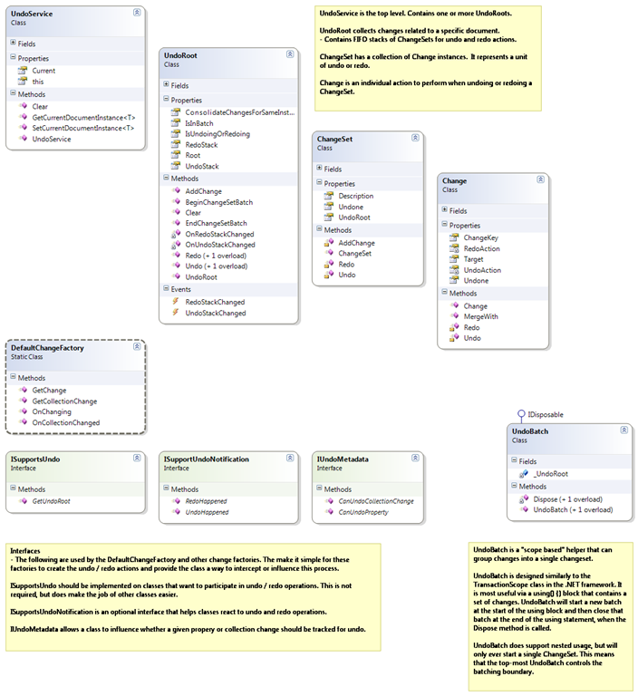

# Design

## Design Goals

1. Simple usage patterns.
2. A __change monitoring__ approach, rather than a __command model__ approach. 


## Change Monitoring 

"Change Monitoring" observes and captures the changes that result from a given action. 

This is kind of like putting a net under the tree, shaking it, and catching what falls out. 

The benefits is simplicity. It requires relatively straight forward changes to the codebase, 
minimal up-front design impact, and robust change handling.

## Command Model Challenges

The "Command Model" typically prescribes that actions against a system should be done via a 
class that knows how to perform the action, and also how to undo that action.

This requires careful planning and design. 

Challenges:
- Requires full understanding of the downstream consequences of an action
  - In a "reactive" system, this can be challenging to implement since one action could 
  result in a cascade of changes through the system.
- Prevents (or complicates) usage of other patterns, like WPF's two-way bindings. 
  - A pure command based implementation would only be able to use one-way bindings, 
  preferring to push updates through a command rather than a binding.


# Classes




## UndoService

`UndoService` is the top level of the undo / redo system. It contains one or more `UndoRoots`, 
accessible via the indexer on the `UndoService`.

`UndoService.Current` property will return the singleton instance of the `UndoService`. 
Use this when interacting with the undo service.

`UndoService.Current[modelRoot]` will return an instance of `UndoRoot` for the specified modelRoot.

 

## UndoRoot

`UndoRoot` collects changes related to a specific document or instance of a model. This allows an application to 
track multiple, distinct undo stacks. This class has most of the public API methods that you'll use to undo, 
redo, and add changes.

Contains FIFO stacks of `ChangeSets` for undo and redo actions. Includes the logic to manage the undo and redo stacks. 
For example, the redo stack is cleared whenever a new undo `ChangeSet` is added.

`UndoRoot.Undo()` will undo the last operation. (Overloads available)

`UndoRoot.Redo()` will redo the last operation. (Overloads available)

`UndoRoot.AddChange()` will add a new `Change` to the system. `ChangeSets` are automatically created as needed.

`UndoRoot.Clear()` will clear the undo and redo stacks.

 

## ChangeSet

`ChangeSet` has a collection of `Change` instances. It represents a unit of undo or redo work.

 

## Change

`Change` is an individual action to perform when undoing or redoing a `ChangeSet`. 
The `Change` class contains `Action()` delegates (or lambdas) that perform the undo and 
redo operations.

 

## UndoBatch

Is a "scope based" helper that can group changes into a single `ChangeSet`. 
It detects new `Changes` that occur and automatically groups them into a single `ChangeSet`.

`UndoBatch` leverages `IDisposable` so that the batch can be contained in a `using` block.
`UndoBatch` will start a new batch at the start of the using block and then close that 
batch at the end of the using statement, when the `Dispose()` method is called.

`UndoBatch` supports nested usage, but will only ever start a single `ChangeSet`. 
This means that the top-most `UndoBatch` controls the batching boundary.

 

## DefaultChangeFactory

`DefaultChangeFactory` is a static utility class that helps populate the undo system with 
`ChangeSet` and `Change` instances. The default implementation uses reflection to access 
the properties of a class.

If implemented, the `DefaultChangeFactory` will take advantage of the interfaces 
(mentioned below) to allow more control over the undo / redo process.

 

# Interfaces

The following are used by the `DefaultChangeFactory` and other change factories. The interfaces make 
it simple for these factories to create the undo / redo actions and provide the class a way to 
intercept or influence this process.

## ISupportsUndo

Should be implemented on classes that want to participate in undo / redo operations.

`ISupportsUndo.GetUndoRoot()` should be implemented and return a reference to the "model root" 
or "document root" that represents the undo boundary.

This is not required to use the undo system, but is required by the `DefaultChangeFactory`.

## ISupportsUndoNotification

An optional interface that helps classes react to undo and redo operations.

This is not required to use the undo system, but is required by the `DefaultChangeFactory`.

## IUndoMetadata

Allows a class to influence whether a given property or collection change should be tracked for undo.

This is not required to use the undo system, but is required by the `DefaultChangeFactory`.


# Notes and Common Issues

## Step Zero... Review the Unit Tests

The unit tests for the Undo system is a great place to start. It will show you the way that the 
classes are supposed to be used, and you can even step through them in debug to understand how 
things work.

## "Undo doesn't seem to work..."

If you are hitting "Undo", but your user interface isn't changing, then the problem might be 
with your `INotifyPropertyChanged` (aka INPC) implementation. Often times, the Undo service is 
actually undoing the changes by updating the model and/or view models. However, if your UI is 
bound to a property that doesn't raise the `PropertyChanged` or `CollectionChanged` event when 
the underlying model changes, then the UI won't update.

One way to check this is to undo some actions, save the model, and then re-open the model. 
If the values are undone, then there is an `INotifyPropertyChanged` gap between the UI's bound 
property and the underlying model.

## "I need to group a set of changes together..."

In some cases, you want to click "Undo" and have it undo a set of changes, not just one change. 
To do this, you'll need to use the `UndoBatch` class to group these changes.

Example of grouping changes:

```c#

[TestMethod]
public void UndoRoot_Supports_Starting_a_Batch_Of_Changes()
{
    var orig = Document1.A.Name;
    var firstChange = "First Change";
    var secondChange = "Second Change";
    var root = UndoService.Current[Document1];

    using (new UndoBatch(Document1, "Change Name", false))
    {
        Document1.A.Name = firstChange;
        Document1.A.Name = secondChange;
    }

    Assert.AreEqual(1, root.UndoStack.Count());
    Assert.AreEqual(0, root.RedoStack.Count());

    root.Undo();
    Assert.AreEqual(orig, Document1.A.Name);
    Assert.AreEqual(0, root.UndoStack.Count());
    Assert.AreEqual(1, root.RedoStack.Count());

    root.Redo();
    Assert.AreEqual(secondChange, Document1.A.Name);
    Assert.AreEqual(1, root.UndoStack.Count());
    Assert.AreEqual(0, root.RedoStack.Count());
}

 ```

## "I'm doing a mouse operation or a calculation that is changing the same field multiple times within the same undo batch. I only need the last value."

If you have a mouse based operation, then your model or view model might be changing repeatedly 
as the user drags the mouse around. This can result in one Change for each discrete position of the mouse.

Typically, the system and the undo service only need to remember the last value. Undoing the operation 
reverts to the original value before dragging the mouse. Redoing applies the value from when they 
stopped dragging the mouse. All intermediate values are irrelevant.

To handle this scenario, the top level `UndoBatch` constructor takes the `bool consolidateChangesForSameInstance` 
parameter. This parameter will tell the undo system that it should only keep the last value for each changed 
property within the batch.

### Note:
This functionality takes a little more processing time, but reduces the memory used.

### Note:
This functionality requires that the `Change` instance have a reliable "token" to uniquely identify the 
property that it is for. The built-in `DefaultChangeFactory` class handles this automatically, but if you are 
manually creating `Change` instances, you'll need to ensure that you have a unique "token" for the property. 

A simple implementation is to use the `Tuple<>` class with a sufficient number of parameters to uniquely 
identify the object instance, and the property on that instance. See the `DefaultChangeFactory` for an 
example of this.

 

 